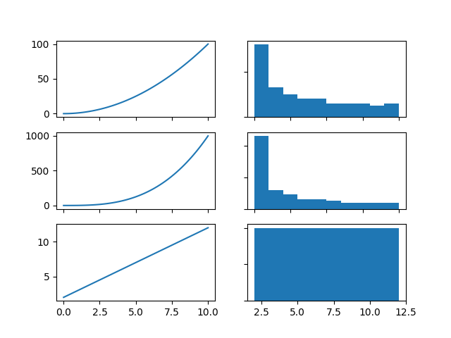

==============
Pythonic Plots
==============

.. image:: https://img.shields.io/pypi/v/pythonic_plots.svg
        :target: https://pypi.python.org/pypi/pythonic_plots

.. image:: https://img.shields.io/travis/knutdrand/pythonic_plots.svg
        :target: https://travis-ci.com/knutdrand/pythonic_plots

.. image:: https://readthedocs.org/projects/pythonic-plots/badge/?version=latest
        :target: https://pythonic-plots.readthedocs.io/en/latest/?version=latest
        :alt: Documentation Status

Wrapper for matplotlib that allows for pythonic plot specifications

* Free software: MIT license
* Documentation: https://pythonic-plots.readthedocs.io.

Features
--------
The point of this package is to wrap `pyplot` plotting functions with lazy evaluations so that subplots can be defined using lists or nested lists. A simple example is::

    >>> from pythonic_plots import plt
    >>> import numpy as np
    >>> x = np.linspace(0, 10, 100)
    >>> panel = [plt.plot(x, x**2),
    ...          plt.plot(x, x**3),
    ...          plt.plot(x, x+2)]
    >>> plt.show(panel)

Or a nested list::

    >>> panel = [[plt.plot(x, x**2), plt.hist(x**2)],
    ...          [plt.plot(x, x**3), plt.hist(x**3)],
    ...          [plt.plot(x, x+2),  plt.hist(x+2)]]
    >>> plt.show(panel)

In order to make each subplot more complicated, addition can be used::

    >>> panel = [plt.plot(x, x**2, label="square") + plt.plot(x, x, label="linear") + plt.legend(),
    ...          plt.plot(x, x**3) + plt.set_title("Cubic function"),
    ...          plt.plot(x, x+2) + plt.set_xlabel("Price")]
    >>> plt.show(panel)
  

And panels can be specified programatically using list comprehensions:

    >>> panel = [[plt.plot(a*x+b)+plt.set_title(f"{a}x+{b}") for b in (0, 1, 2)]
    ...          for a in (0.5, 2, 3)]
    >>> plt.show(panel, sharex=True, sharey=True)

Credits
-------

This package was created with Cookiecutter_ and the `audreyr/cookiecutter-pypackage`_ project template.

.. _Cookiecutter: https://github.com/audreyr/cookiecutter
.. _`audreyr/cookiecutter-pypackage`: https://github.com/audreyr/cookiecutter-pypackage
